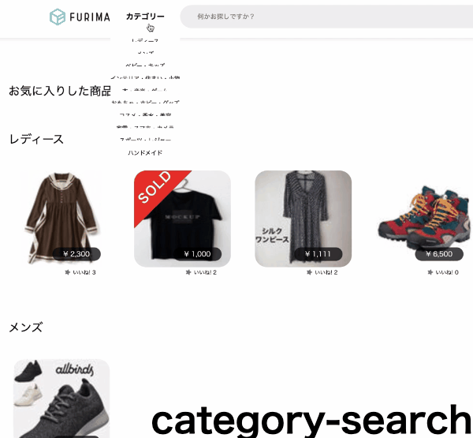

# フリマーケットアプリ
5人チームのアジャイル開発でフリーマーケットサービスのクローンサイトの作成を行いました。
下記、自身で実装した箇所、および開発を通じて得られた経験について紹介します。
# リンク
http://18.176.184.85/

Basic認証をかけています。ご覧の際は以下のIDとPassを入力してください。

- Basic認証
  - ID: admin
  - Pass: admin9999

# テストユーザー
- 購入者用アカウント
  - メールアドレス: buyer@gmail.com
  - パスワード: buyer9999
 
- 購入用カード情報
  - 番号：4242424242424242
  - 期限：12/20
  - セキュリティコード：123

- 出品者用アカウント
  - メールアドレス名: seller@gmail.com
  - パスワード: seller9999

# takeshikataの開発担当箇所
## トップページ
### カテゴリー検索機能

## Usersテーブル
|Column|Type|Options|
|------|----|-------|
|nickname|string|null: false|
|email|string|null: false, unique: true|
|password|string|null: false|
### Association
- has_one :profile
- has_one :address
- has_many :products
## Profileテーブル
|Column|Type|Options|
|------|----|-------|
|user|references|null: false,foreign_key: true|
|first_name|string|null: false|
|last_name|string|null: false|
|first_name_kana|string|null: false|
|last_name_kana|string|null: false|
|birth_year|integer|null: false|
|birth_month|integer|null: false|
|birth_date|integer|null: false|
### Association
- belongs_to :user

## Addressテーブル
|Column|Type|Options|
|------|----|-------|
|user|references|null: false, foreign_key: true|
|first_name|string|null: false|
|last_name|string|null: false|
|first_name_kana|string|null: false|
|last_name_kana|string|null: false|
|zip_code|integer(7)|null: false|
|prefecture|integer|null: false|
|city|string|null: false|
|street_number|string|null: false|
|apartment|string||
|telephone|integer||
### Association
- belongs_to :user
## Productsテーブル
|Column|Type|Options|
|------|----|-------|
|user|references|null: false, foreign_key: true|
|name|string|null: false|
|introduction|text|null: false|
|category|references|null: false, foreign_key: true|
|brand|references|null: false, foreign_key: true|
|product_condition|references|null: false, foreign_key: true|
|shipping_payer|references|null: false, foreign_key: true|
|shipping_region|references|null: false, foreign_key: true|
|preparation_term|references|null: false, foreign_key: true|
|price|integer|null: false|
### Association
- belongs_to :user
- has_many :images
- belongs_to :category
- belongs_to :brand
- belongs_to :product_condition
- belongs_to :preparation_term
- belongs_to :shipping_region
- belongs_to :shipping_payer
## imageテーブル
|Column|Type|Options|
|------|----|-------|
|image|string|null: false|
|product|references|null: false, foreign_key: true|
### Association
- belongs_to :products
## categoryテーブル
|Column|Type|Options|
|------|----|-------|
|name|string|
|ancestry|string|
### Association
- has_many :products
## brandテーブル
|Column|Type|Options|
|------|----|-------|
|name|string|null: false|
### Association
- has_many :products
## product_conditionテーブル
|Column|Type|Options|
|------|----|-------|
|condition|integer|null:false|
### Association
- has_many :products
### Condition
1:新品、未使用
2:未使用に近い
3:目立った傷た汚れなし
4:やや傷や汚れあり
5:傷や汚れあり
6:全体的に状態が悪い
## preparation_termテーブル
|Column|Type|Options|
|------|----|-------|
|term|integer|null:false|
### Association
- has_many :products
### term
1:1-2日
2:2-3日
3:4-7日
## shipping_regionテーブル
|Column|Type|Options|
|------|----|-------|
|region|integer|null:false|
### Association
- has_many :products
## shipping_payerテーブル
|Column|Type|Options|
|------|----|-------|
|buyer|integer|null:false|
|seller|integer|null:false|
### Association
- has_many :products
