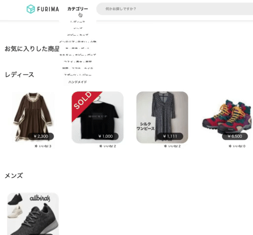
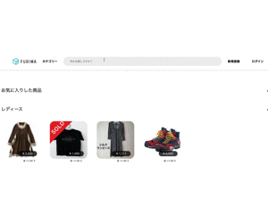
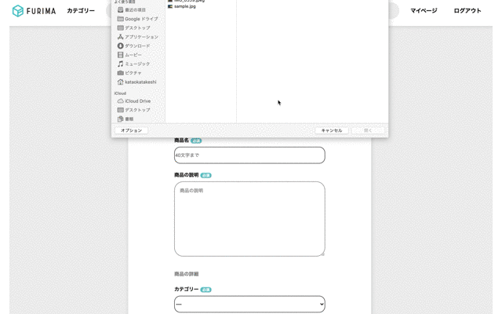
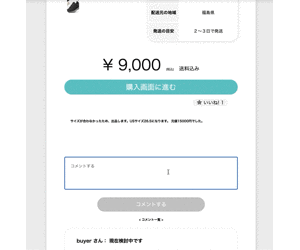
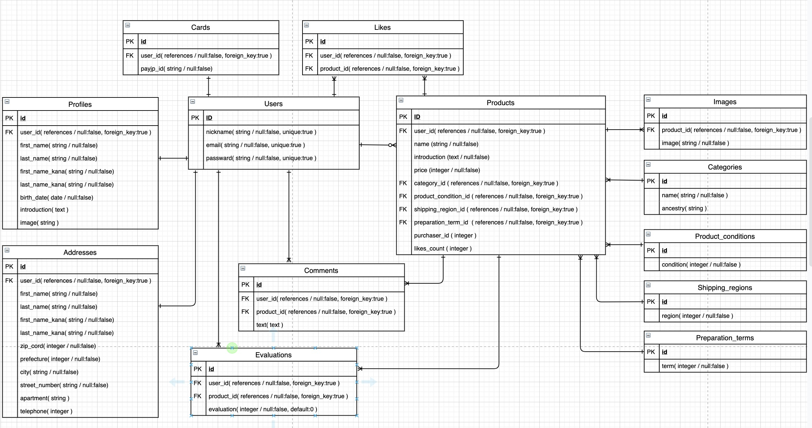

# フリマーケットアプリ
5人チームのアジャイル開発でフリーマーケットサービスのクローンサイトの作成を行いました。 
下記、自身で実装した箇所などを記載いたします。
# リンク
http://18.176.184.85/

Basic認証をかけています。ご覧の際は以下のIDとPassを入力してください。

- Basic認証
  - ID: admin
  - Pass: admin9999

# テストユーザー
- 購入者用アカウント
  - メールアドレス: buyer@gmail.com
  - パスワード: buyer9999
 
- 購入用カード情報
  - 番号：4242424242424242
  - 期限：12/20
  - セキュリティコード：123

- 出品者用アカウント
  - メールアドレス名: seller@gmail.com
  - パスワード: seller9999

# takeshikataの開発担当箇所
# トップページ
## カテゴリー検索機能

  - カテゴリーボタンからカテゴリーごとに検索できます。
  - scssのみを使用し、動的なカテゴリー検索を実装しました。

## キーワード検索機能

  - 検索欄から商品のキーワードごとに検索できます。
  - 部分一致する商品を表示させ、キーワードなしで検索した場合すべての商品が表示されます。
# 商品出品ページ
## 出品画像の出品、編集、削除機能

  - field_forを用いて、複数画像の登録を実装しました。
  - JSを活用して登録画像の削除をし、その差分もデータベースに反映されるように実装しました。

# 商品詳細ページ
## コメント機能

  - ログインユーザーのみ、コメント投稿できるように実装しました
  
# DB設計

## 各種バリデーション

## 単体テスト/統合テスト(Rspec)

# 開発環境/使用技術一覧
  - Ruby
  - Ruby on Rails
  - MySQL
  - Github
  - AWS
  - Atom/VScode
  - Haml
  - Sass
  - jQuery
  - Rspec
